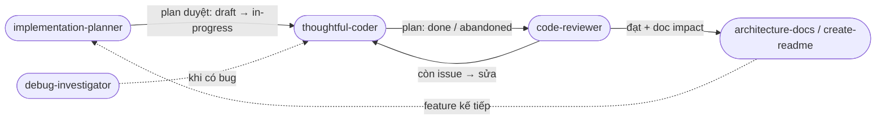

# Agent Skills

Bộ skill toàn cục cho AI coding agents (Claude Code, Antigravity, Gemini, Cursor, ...). Skills viết theo định dạng `SKILL.md` với YAML frontmatter — Claude Code auto-discover qua `/<skill-name>`, agent khác đọc `SKILL.md` trực tiếp.

## Yêu cầu

Skills giả định 2 thứ có sẵn trong project:

1. **CodeGraph MCP** — index AST cho mọi câu hỏi structural. Skills sẽ delegate `codegraph_search`, `codegraph_callers`, `codegraph_impact`, `codegraph_context` thay vì grep/read thủ công.
   ```bash
   npm install -g @colbymchenry/codegraph
   codegraph init -i      # 1 lần mỗi repo, tạo .codegraph/
   ```
2. **`.agents/` docs** — agent guidance project-specific (boundary, gotcha, testing). Bootstrap tự động bằng `architecture-docs` khi skill nào cần mà folder chưa tồn tại.

## Install

**Global** (khuyến nghị, áp dụng cho mọi project):

```bash
git clone https://github.com/Flowerf19/agents-skills.git ~/.claude/skills
```

**Per-project** (submodule, pinned version cho team):

```bash
cd <project>
git submodule add https://github.com/Flowerf19/agents-skills.git .agents/skills
mkdir -p .claude && ln -s ../.agents/skills .claude/skills    # Claude Code discovery
```

Update upstream: `cd ~/.claude/skills && git pull` (hoặc `git submodule update --remote .agents/skills`).

## Skills (6)

| Skill | Khi dùng | Output |
|---|---|---|
| [`implementation-planner`](implementation-planner/SKILL.md) | Trước khi code feature/bug/refactor lớn | `.agents/plans/<slug>.md` với `status:` lifecycle (draft/in-progress/done/abandoned) |
| [`thoughtful-coder`](thoughtful-coder/SKILL.md) | Mỗi code change | Diff tối thiểu + Documentation impact block + plan close-out |
| [`debug-investigator`](debug-investigator/SKILL.md) | Khi có bug, test fail, perf regression | Root cause + handoff sang `thoughtful-coder` |
| [`code-reviewer`](code-reviewer/SKILL.md) | Sau `thoughtful-coder`, trước merge | Issue list Critical/Important/Minor + verdict |
| [`architecture-docs`](architecture-docs/SKILL.md) | Sau arch change lớn / refactor đụng nhiều file | `.agents/{README,PROJECT_CONTEXT,AGENT_RULES,TESTING_GUIDE}.md`, audit stale references trước khi sửa |
| [`create-readme`](create-readme/SKILL.md) | README dự án thiếu hoặc stale | Root `README.md` từ evidence (manifests, docker, entrypoints) |

## Cách dùng

### Invoke theo agent type

**Claude Code** — gõ `/<skill-name>` trong chat, hoặc để auto-discover: mô tả task bằng ngôn ngữ tự nhiên, Claude Code scan `description` trong frontmatter và tự chọn skill phù hợp.

```
/implementation-planner Thêm OAuth2 login cho gateway service
/thoughtful-coder Fix null pointer khi user chưa có profile
/code-reviewer HEAD~1..HEAD
```

**Codex / Antigravity / Cursor / agent khác** — không có slash-command discovery. Trỏ agent đọc `~/.claude/skills/<name>/SKILL.md` và follow procedural instruction trong body. Ví dụ với Cursor: attach file `~/.claude/skills/debug-investigator/SKILL.md` vào context rồi mô tả bug.

### Ví dụ cụ thể mỗi skill

| Skill | Input ví dụ | Output nhận được |
|---|---|---|
| `implementation-planner` | `"Thêm rate limiting vào API gateway"` | `.agents/plans/rate-limiting.md` — GOAL/TASK IDs, completion ledger `\| ID \| Task \| Done \| Date \|`, YAML header `status: draft` |
| `implementation-planner` _(update)_ | `"Scope thay đổi: bỏ Redis, dùng in-memory"` | Plan cũ được update in-place — task cũ giữ nguyên ID, task mới append ID tiếp theo, task bị thay thế gạch chân với lý do |
| `thoughtful-coder` | `"Implement TASK-003 trong plan rate-limiting"` | Diff tối thiểu + Documentation impact block + tick ✅ TASK-003 trong ledger |
| `debug-investigator` | Stack trace `KeyError: 'user_id'` trong `handler.py:142` | Root cause 1 câu (cause→effect) + failing test + handoff sang `thoughtful-coder` |
| `code-reviewer` | `git diff origin/main..HEAD` hoặc PR number | Danh sách issue phân loại Critical/Important/Minor + verdict `Approve / Approve with fixes / Request changes` |
| `architecture-docs` | `"Refresh .agents/ sau khi refactor memory module"` | `.agents/README.md`, `PROJECT_CONTEXT.md`, `AGENT_RULES.md`, `TESTING_GUIDE.md` — stale references đã audit và fix |
| `create-readme` | `"Viết README cho repo này"` | `README.md` từ manifests, docker, entrypoints — không file dump, không codegraph duplication |

> **Tip:** `implementation-planner` hỗ trợ cả tạo plan mới lẫn update plan hiện có. IDs (`TASK-`, `GOAL-`) append-only — không bao giờ đánh số lại.

## Workflow chain



## Cấu trúc `.agents/`

Thư mục guidance mà các skill tạo & duy trì trong mỗi project:

```text
.agents/
├── README.md
├── PROJECT_CONTEXT.md
├── AGENT_RULES.md
├── TESTING_GUIDE.md
└── plans/
    └── <slug>.md
```

- `README.md`, `PROJECT_CONTEXT.md`, `AGENT_RULES.md`, `TESTING_GUIDE.md` → do `architecture-docs` sinh/refresh.
- `plans/<slug>.md` (có `status:` lifecycle) → do `implementation-planner` tạo, `thoughtful-coder` close-out.

## Quy tắc chung

1. **`.agents/` bootstrap** — repo chưa có thì skill nào đụng vào cũng phải gọi `architecture-docs` trước.
2. **CodeGraph first** — câu hỏi structural đi qua codegraph trước khi grep/Read.
3. **Không duplicate codegraph trong output** — không file structure dump, symbol inventory, caller/callee chain trong doc/plan/README. Codegraph trả lời on-demand.
4. **Instruction entrypoints** — skill đọc theo thứ tự: `AGENTS.md` → `CLAUDE.md` → `.github/copilot-instructions.md` → `.agents/README.md`.

## Format

Mỗi skill là 1 folder chứa `SKILL.md` với frontmatter YAML:

```yaml
---
name: <kebab-case-name>
description: <one line — Claude scan để quyết invoke>
argument-hint: <input format hint>
---
```

Body là procedural instruction (không "You are a..."). Claude Code load nội dung khi skill được invoke.

## Đóng góp

PR welcome. Trước khi propose skill mới, check 2 câu hỏi:

1. Có thể nhét vào skill cũ qua 1 section (10-20 dòng) không?
2. Pain có recurring + workflow khác hẳn skill hiện tại không?

Cả 2 trả lời CÓ → skill mới. Còn lại → tinh skill cũ. Sweet spot là 6 skill — thêm nữa thì noise vs signal xấu đi.
